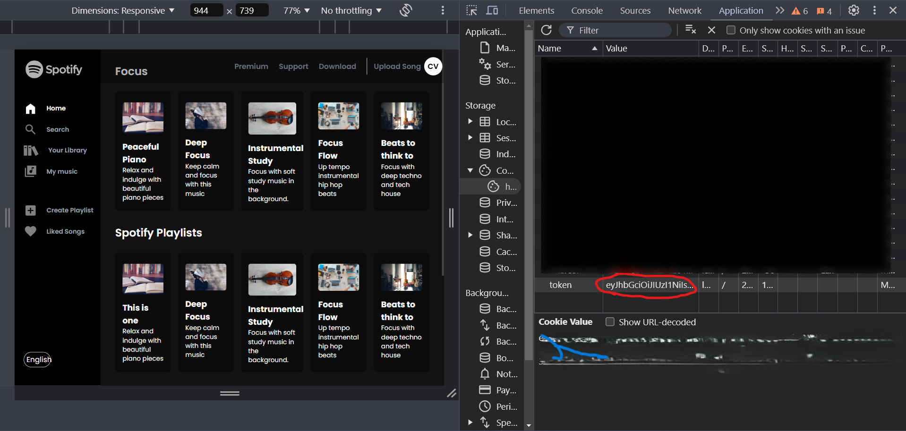
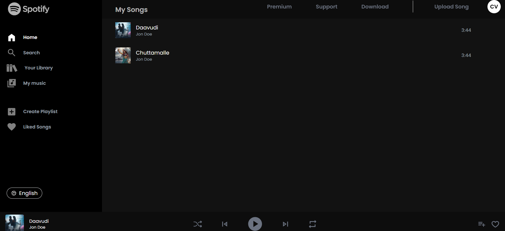
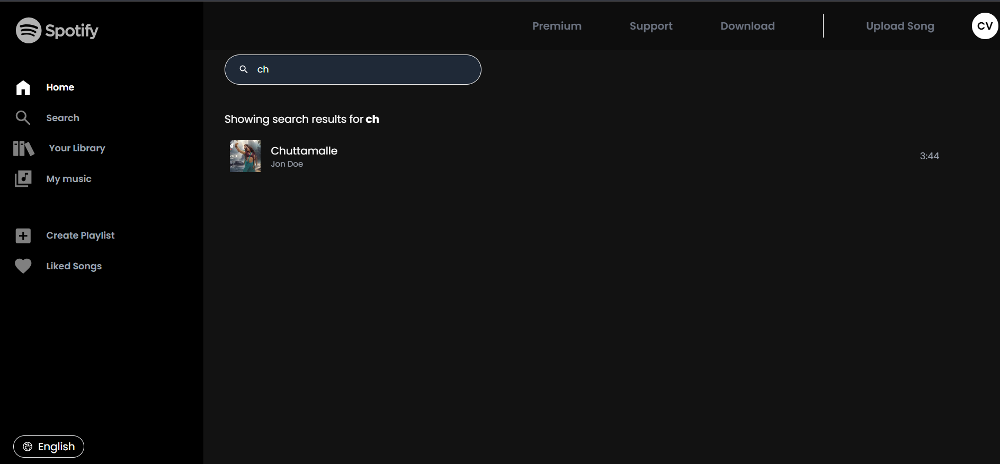
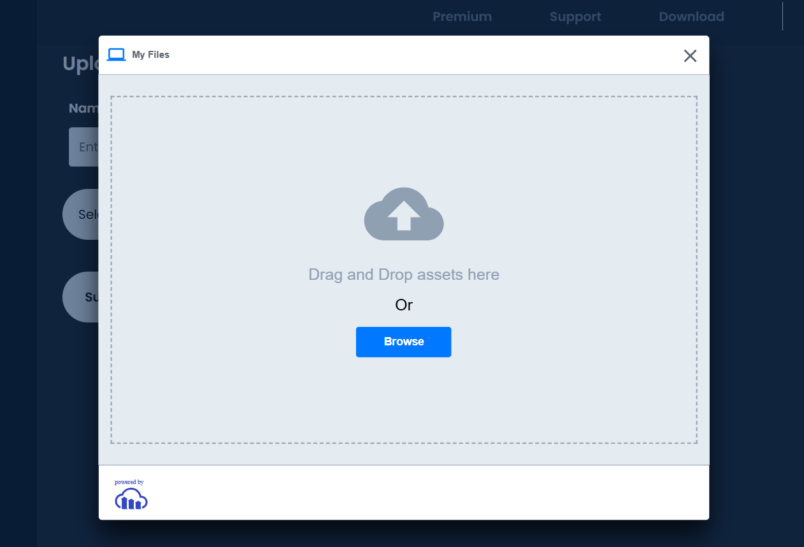

# Spotify Clone

Welcome to the **Spotify Clone** project! This application replicates the core functionalities of a music streaming service with advanced features like secure authentication, song uploads, and playback, built with cutting-edge technologies.

---

## Features

- **JWT Authentication**: Ensures all API calls are securely verified.
- **Song Uploads**: Easily upload songs using **Cloudinary** integration.
- **Music Playback**: Smooth and high-quality playback powered by the **Howler.js** library.
- **Modern UI**: A sleek, responsive interface styled with **TailwindCSS**.
- **Robust Backend**: Developed with **Node.js** and **MongoDB** for reliable data storage and handling.

---

## Technologies Used

- **Frontend**: TailwindCSS, React.js
- **Backend**: Node.js, Express.js, MongoDB
- **Authentication**: JWT (JSON Web Tokens)
- **Cloud Services**: Cloudinary (for song uploads)
- **Music Playback**: Howler.js (audio library)

---

## Getting Started

### 1. Clone the Repository

```bash
git clone https://github.com/Vaibhav-C-S/SpotifyClone.git
```
### 2. Project Structure

1.SpotifyClone/

2a. spotify_backend

2b.tailwind_frontend


### 3.Backend Setup

1. Navigate to the backend folder:
   ```bash
   cd SpotifyClone/spotify_backend
    npm install
   ```
please fill the .env file with respective details
2.To run Backend
```bash
  node ./index.js
```

### 4. Front end Setup

```bash
cd SpotifyClone/tailwind_frontend
npm install
```

### To configure the cloudinary settings go to
### public/src/assets/shared/CloudinaryUpload.jsx
### Keep the respective cloud_name and preset_name


To start
```bash
npm run dev
```

### API Overview

All API calls are authenticated using JWT. Ensure to include the token in the request headers:
Authorization: Bearer <Your_JWT_Token>

## Key Endpoints

### POST /api/auth/register
- Register a new user.

### POST /api/auth/login
- Log in to receive a token.

### POST /api/songs/upload
- Upload a new song (requires token).

### GET /api/songs
- Fetch a list of songs.

### Screenshots
# Project Images

## Token-Based Authentication


## Song View


## Search Page


## Cloudinary Upload Demo



